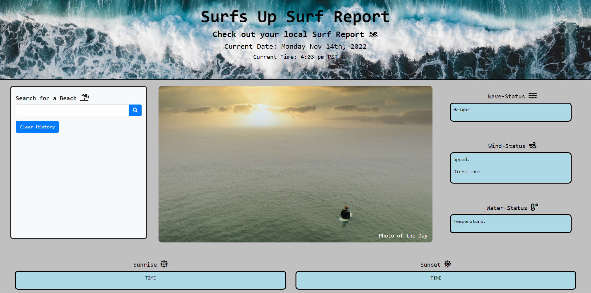

# Project 1: Surf Report
For this project, our team created an application where users can look up surf conditions by searching for a beach or city. When searched by the city the application will provide surf reports for the nearest beach to the user. 
Our application will provide users with important information such as wave height, wind speed, wind direction, water temperature, sunrise and sunset. Past searches will be saved to the box under the search bar to quickly and easliy compare surf conditions of differnt beaches. 

## Screenshot of deployed website 
 

### Deployed Site 
https://canaano.github.io/Surfs-Up-Surf-Report/

### Contributors 
John Kang - https://github.com/JYK33
Canaan Owens - https://github.com/canaano 
Jiushu Mao  - https://github.com/mjs757
Juan Garcilazo - https://github.com/juangarcilazo